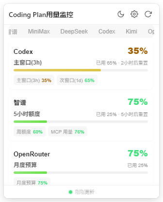
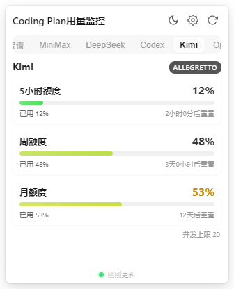
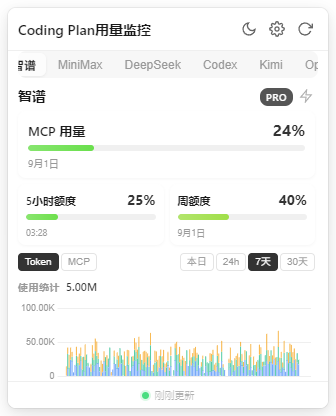

# Coding Quota Bar


**Windows 托盘里的 AI Coding 额度看盘器。** 一个图标看尽 8 家服务商的套餐余量，5 小时窗口、周额度、月度限额、消费预算全在一屏，不用挨个打开网页后台，不打断编码心流。

## 为什么用它

- **托盘数字常驻** — 图标直接渲染剩余百分比（纯代码位图，不占内存），绿/黄/红三色随余量变化，扫一眼就知道还能不能放开写
- **总览看盘** — 悬浮/点击托盘弹出面板，默认进总览页：所有服务商的关键额度一屏排开，哪个最紧排最前，点击卡片直达详情
- **盯最紧的那条线** — Kimi / OpenCode Go / 智谱的 5 小时滚动窗口是主指标（重置最快、最先爆），周/月额度做副卡；带重置倒计时和爆仓时间预估
- **消费也看得住** — OpenRouter 月度预算进度、DeepSeek 余额与月度消费、按 token 估算的等价费用
- **多账户** — 同一平台配多个 Key（工作号 + 测试号），托盘自动显示最危险的账户
- **数据够细** — Token 用量趋势（7 天小时级）、MCP 工具调用统计、模型解码速度/成功率、90 天服务状态（DeepSeek）
- **本地优先** — API Key 用系统级 safeStorage 加密存储，数据只进各平台官方接口，无任何云端上报

## 预览

**总览看盘** — 打开面板默认显示，所有服务商关键额度一屏（最紧的排最前；Kimi 主指标为 5h 窗口，周/月额度做副卡）：



**Kimi 详情页** — 5h / 周 / 月三档额度卡 + 套餐档位徽标 + 并发上限：



**智谱详情页** — 多窗口额度 + Token 用量趋势图表 + MCP 用量 + 预估费用：



## 支持的平台

| 平台 | 认证方式 | 监控内容 |
|------|----------|----------|
| **智谱 AI（GLM Coding）** | API Key | 5h/日/周 Token 额度、MCP 用量、模型性能、用量趋势图表、订阅信息、预估费用 |
| **Kimi（Kimi Coding）** | API Key（`sk-kimi-`） | 5h/周/月额度、套餐档位徽标、并发上限 |
| **OpenCode Go** | API Key | 5h/周/月三档剩余额度 |
| **OpenRouter** | API Key | 月度消费预算进度（未设预算显示消费金额） |
| **DeepSeek** | API Key / 网页登录 | 账户余额（总/赠送/充值）、自定义预算、月度消费明细、API 与网页 90 天运行状态 |
| **MiniMax** | API Key | 5h 滚动窗口 + 自然周额度 |
| **MiMo** | 网页登录 | 套餐总用量、月度用量、Token 用量、账户余额 |
| **Codex** | 读取本机 Codex CLI 登录 | 主/次窗口限流、代码审查额度、Credits 余额、订阅到期 |

## 功能亮点

### 托盘常驻 + 颜色预警

托盘图标显示所有账户中最低的剩余百分比：

- **绿色** — 剩余 > 50%，放心用
- **黄色** — 剩余 20%–50%，注意控制
- **红色** — 剩余 < 20%，省着点

阈值和颜色都可在设置页自定义，带实时预览。

### 爆仓预估与洞察

- **爆仓时间预估** — 按近期消耗速率推算"还能写多久"，< 2h 红色闪烁提醒
- **周对比 / 主力模型 / 高峰时段** — Insights 洞察模块（纯本地计算，不调 LLM）

### 并发测试

智谱用户可一键测模型并发：TTFT / 吞吐 / 成功率分布，帮你选高峰期最稳的模型。

### 体验细节

- **弹窗三态固定** — 不固定 / 置顶固定 / 桌面固定，高度可拖拽调整并记忆
- **自动刷新** — 1–30 分钟可配，失败自动重试（线性退避 + 抖动）
- **深色/浅色主题** — 跟随系统或手动
- **中英双语** — 完整 i18n
- **开机自启动** / **自动更新检测**

## 安装

访问 [GitHub Releases](https://github.com/Timeink88/coding-quota-bar/releases) 下载安装包。

### 从源码构建

```bash
git clone https://github.com/Timeink88/coding-quota-bar.git
cd coding-quota-bar
npm install
npm run dev           # 开发模式（CQB_DEV=1 CQB_MOCK=1 可用模拟数据调试）
npm run dist          # 打包 Windows 安装程序
```

各平台接口的逆向笔记见 [docs/provider-apis.md](docs/provider-apis.md)，欢迎贡献新的 Provider。

## 技术栈

Electron 34 + Vue 3 + TypeScript + Vite 7

**架构亮点**：

- Provider 插件模式 — 各 AI 平台独立实现，注册表动态加载
- 多账户并行调度 — 不同服务商并行请求，同服务商串行避免限流
- 纯代码生成托盘图标 — 5×7 位图字体渲染，无外部图片依赖
- 编译时配置（`app.build.ts`）控制 Provider 可用性，运行时配置管理用户数据

## 反馈与交流

遇到问题或有建议？欢迎加入[飞书反馈群](https://applink.feishu.cn/client/chat/chatter/add_by_link?link_token=9f3hcab1-6867-43e9-938e-3f49bb3ccdc3)交流：


## License

MIT
